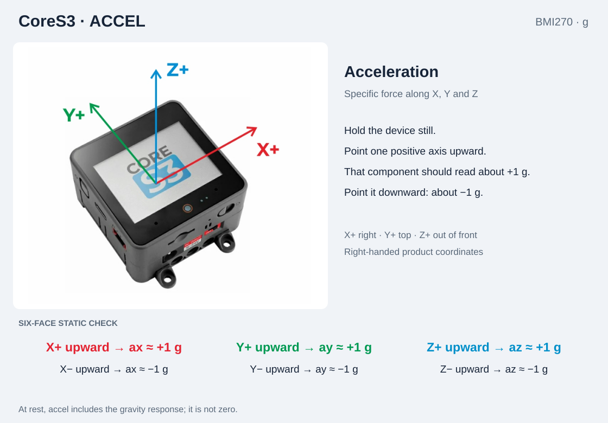
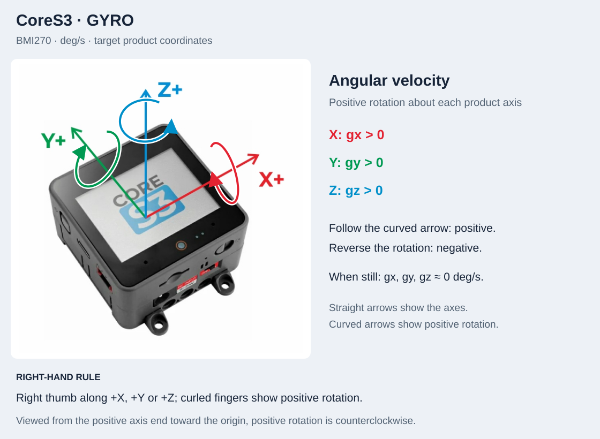
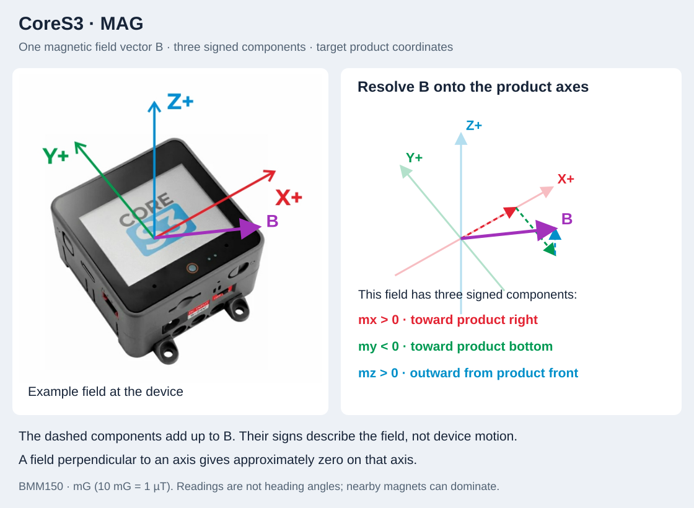

# CoreS3 IMU directions

CoreS3 has a BMI270 accelerometer/gyroscope and a BMM150 magnetometer.
Face the display with the camera edge at the bottom. X points to the product's
right, Y toward its top, and Z outward from the display face.

The diagrams define the target product frame for verification. They do not
certify the current driver output or change its mappings.

## Acceleration

Hold each positive axis vertically upward, then downward. Check approximately
+1 g and -1 g on that axis; the other two should be near zero when aligned.

## Angular velocity

Rotate around each axis in both directions. A positive rotation is counterclockwise
when looking from the positive end of that axis toward the origin. Test one axis
at a time; a still device should have angular velocity near zero.

## Magnetic field

Use a stable reference field to check component signs. Do not infer a compass
heading from one component. Magnets in a base or attachment and nearby metal
can disturb the reading; arrange the test environment before judging a mapping.

## Verification checklist

- [ ] Confirm the fixed housing pose.
- [ ] Accel: test all six static orientations.
- [ ] Gyro: test positive and negative rotation around X, Y and Z.
- [ ] Mag: check each axis against a stable reference field.
- [ ] Record library versions, hardware revision and any mismatches.

[Test procedure](../guides/imu-axis-test.md) · [IMU API](../api/imu.md) · [Device index](README.md)
