# IMU host reference

The host list and grouping follow M5GFX's `docs/device-orientation.md`, including
its pending figures. Kits and hardware revisions are included under their host.

**ACCEL** = accelerometer; **GYRO** = gyroscope; **MAG** = magnetometer.
**Yes** = fitted; **No** = absent from the documented configuration;
**Varies** = see the model/revision note; **Pending** = missing or conflicting evidence.
A six-axis IMU provides ACCEL/GYRO, not MAG. External sensors are excluded.

Photographs come from the [official product catalog](https://docs.m5stack.com/zh_CN/products).
Sensor availability follows the linked product specifications and may differ
across hardware revisions. CoreS3 is the first annotated axis example;
the remaining images identify their hosts without direction overlays.

Reviewed: 2026-09-21. [Hardware sources](../assets/imu/hosts/products/sources.json).

## Device figures

### Atom

<table>
<tr>
<td width="25%" align="center" valign="top">
<strong><a href="https://docs.m5stack.com/zh_CN/core/AtomS3">AtomS3</a></strong> 
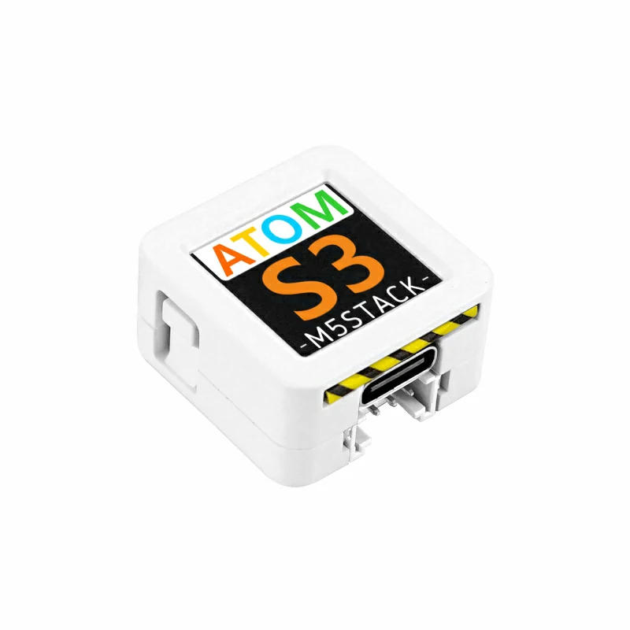 
ACCEL: <strong>Yes</strong> · MPU6886 
GYRO: <strong>Yes</strong> · MPU6886 
MAG: <strong>No</strong> 
</td>
<td width="25%" align="center" valign="top">
<strong><a href="https://docs.m5stack.com/zh_CN/core/AtomS3R">AtomS3R</a></strong> 
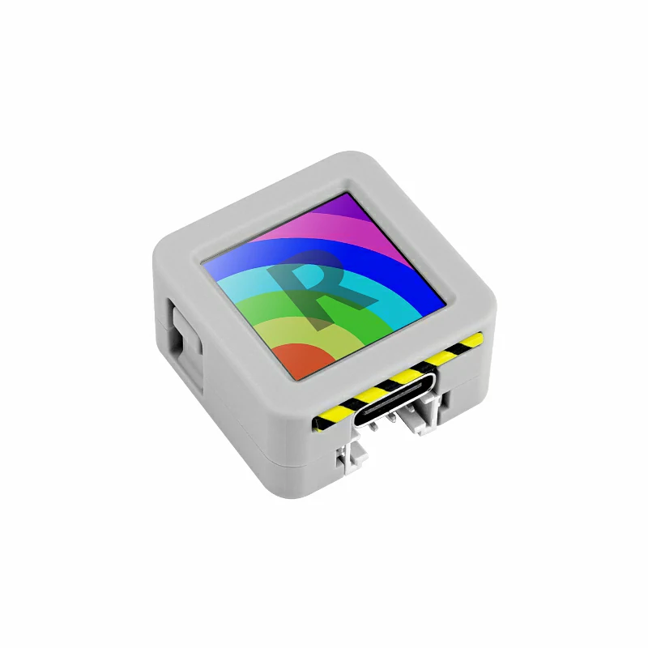 
ACCEL: <strong>Yes</strong> · BMI270 
GYRO: <strong>Yes</strong> · BMI270 
MAG: <strong>Yes</strong> · BMM150 
</td>
<td width="25%"></td>
<td width="25%"></td>
</tr>
</table>

### Core

<table>
<tr>
<td width="25%" align="center" valign="top">
<strong>Core (<a href="https://docs.m5stack.com/zh_CN/core/basic_v2.7">Basic</a> / <a href="https://docs.m5stack.com/zh_CN/core/m5go_v2.7">M5GO</a> / <a href="https://docs.m5stack.com/zh_CN/core/gray">Gray</a>)</strong> 
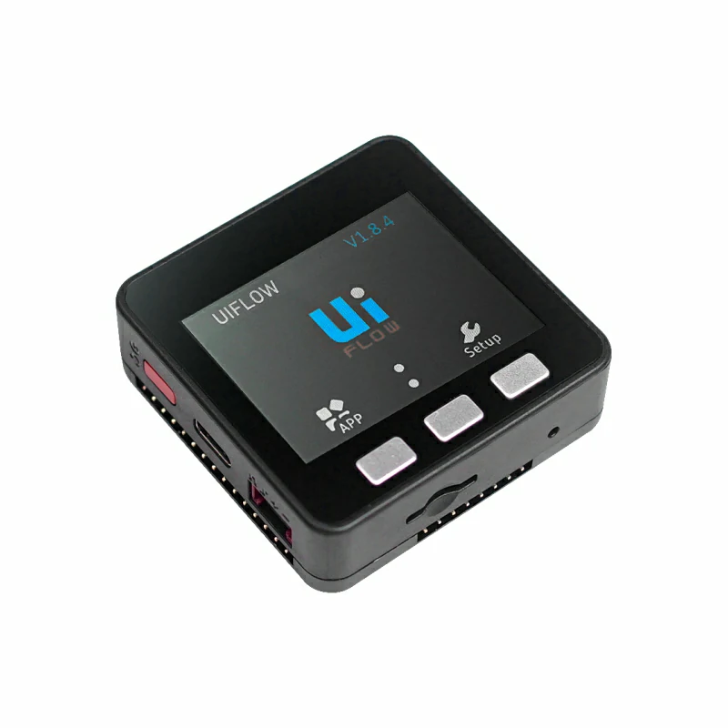 
ACCEL: <strong>Varies</strong> 
GYRO: <strong>Varies</strong> 
MAG: <strong>Varies</strong> 
<small>Basic: no ACCEL/GYRO/MAG. Gray: MPU6886 + BMM150. M5GO: MPU6886 + BMM150 originally; no MAG since v2.6. Earlier chips vary; see product history.</small> 
</td>
<td width="25%" align="center" valign="top">
<strong><a href="https://docs.m5stack.com/zh_CN/core/Core2_v1.3">Core2</a></strong> 
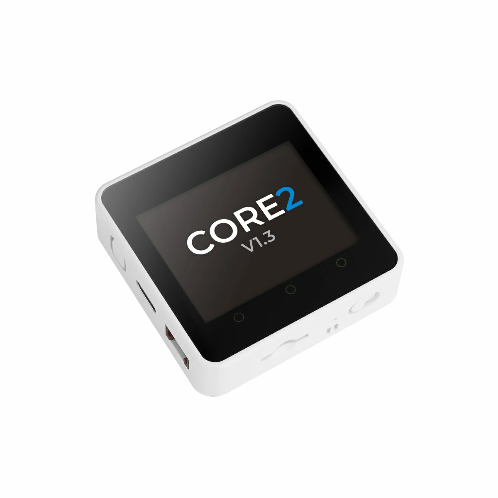 
ACCEL: <strong>Yes</strong> · MPU6886 / BMI270 
GYRO: <strong>Yes</strong> · MPU6886 / BMI270 
MAG: <strong>No</strong> 
<small>Core2 and v1.1: MPU6886. v1.3: BMI270. Photograph shows v1.3.</small> 
</td>
<td width="25%" align="center" valign="top">
<strong><a href="https://docs.m5stack.com/zh_CN/core/CoreS3">CoreS3</a></strong> 
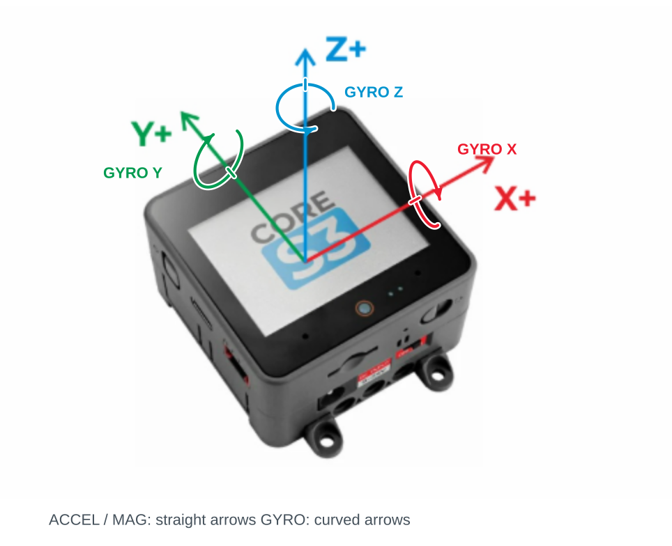 
ACCEL: <strong>Yes</strong> · BMI270 
GYRO: <strong>Yes</strong> · BMI270 
MAG: <strong>Yes</strong> · BMM150 
<small>Includes CoreS3-Lite with the same sensors. CoreS3SE is a separate board.</small> 
</td>
<td width="25%" align="center" valign="top">
<strong><a href="https://docs.m5stack.com/zh_CN/core/fire_v2.7">Fire</a></strong> 
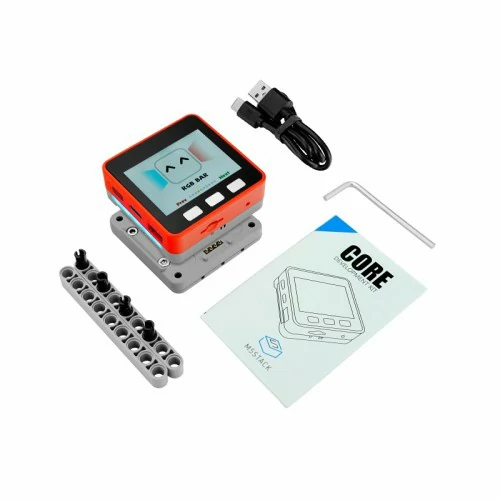 
ACCEL: <strong>Yes</strong> · MPU6886 
GYRO: <strong>Yes</strong> · MPU6886 
MAG: <strong>Varies</strong> 
<small>v2.6 / v2.7: MPU6886, no MAG. Original Fire: MPU6886 or SH200Q + BMM150; earlier MPU9250. Photograph shows v2.7.</small> 
</td>
</tr>
<tr>
<td width="25%" align="center" valign="top">
<strong><a href="https://docs.m5stack.com/zh_CN/core/tough">Tough</a></strong> 
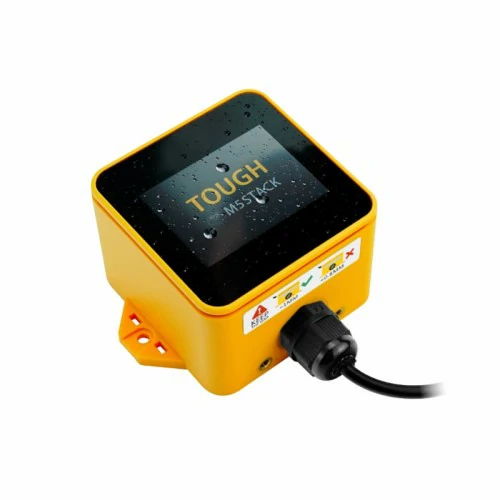 
ACCEL: <strong>Pending</strong> 
GYRO: <strong>Pending</strong> 
MAG: <strong>No</strong> 
<small>IMU pending: selector lists MPU6886; product specifications and pin map omit it.</small> 
</td>
<td width="25%" align="center" valign="top">
<strong><a href="https://docs.m5stack.com/zh_CN/core/ToughC5">ToughC5</a></strong> 

<em>Catalog image pending</em>

ACCEL: <strong>No</strong> 
GYRO: <strong>No</strong> 
MAG: <strong>No</strong> 
<small>Product specifications available; catalog image pending.</small> 
</td>
<td width="25%" align="center" valign="top">
<strong><a href="https://docs.m5stack.com/zh_CN/core/StackChan_Core">StackChan</a></strong> 
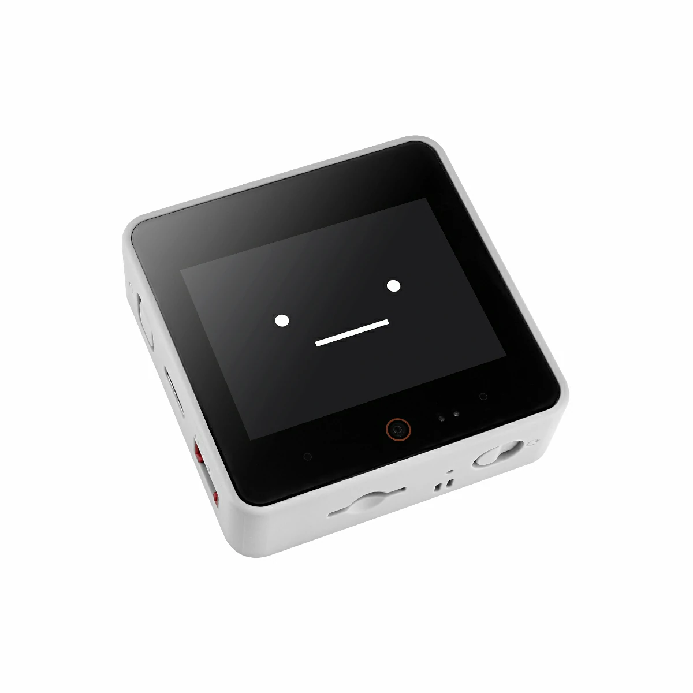 
ACCEL: <strong>Yes</strong> · BMI270 
GYRO: <strong>Yes</strong> · BMI270 
MAG: <strong>Yes</strong> · BMM150 
</td>
<td width="25%" align="center" valign="top">
<strong><a href="https://docs.m5stack.com/zh_CN/core/M5CoreS3%20SE">CoreS3SE</a></strong> 
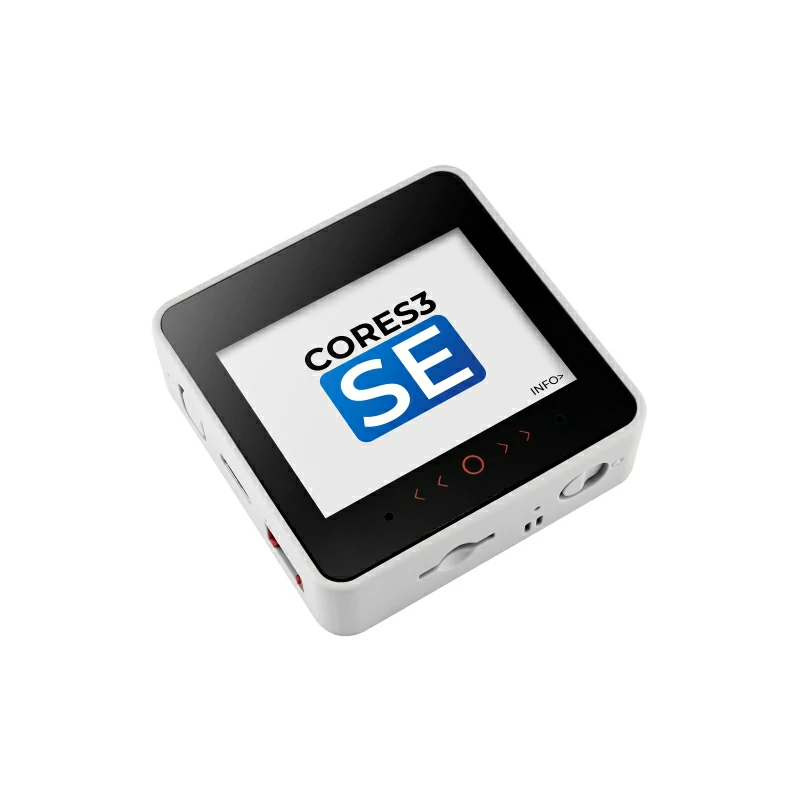 
ACCEL: <strong>No</strong> 
GYRO: <strong>No</strong> 
MAG: <strong>No</strong> 
<small>Official CoreS3 comparison explicitly excludes IMU and MAG.</small> 
</td>
</tr>
</table>

### Paper

<table>
<tr>
<td width="25%" align="center" valign="top">
<strong><a href="https://docs.m5stack.com/zh_CN/core/coreink">CoreInk</a></strong> 
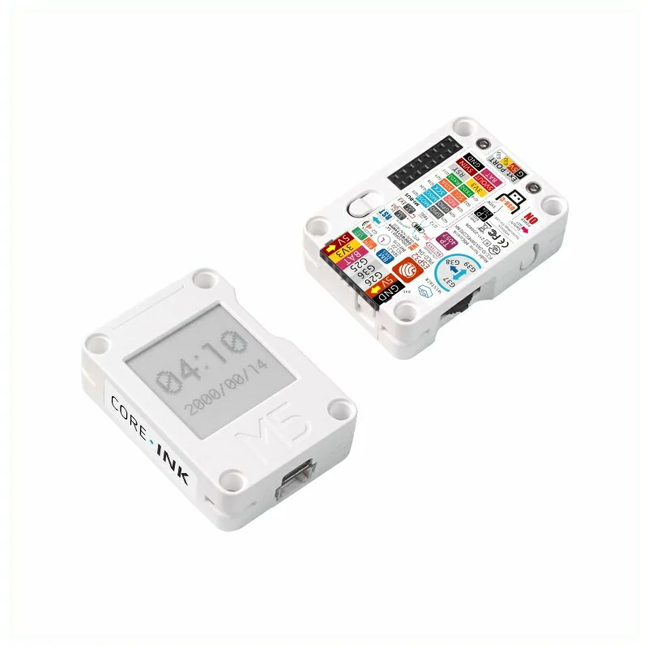 
ACCEL: <strong>No</strong> 
GYRO: <strong>No</strong> 
MAG: <strong>No</strong> 
</td>
<td width="25%" align="center" valign="top">
<strong><a href="https://docs.m5stack.com/zh_CN/core/m5paper_v1.1">Paper</a></strong> 
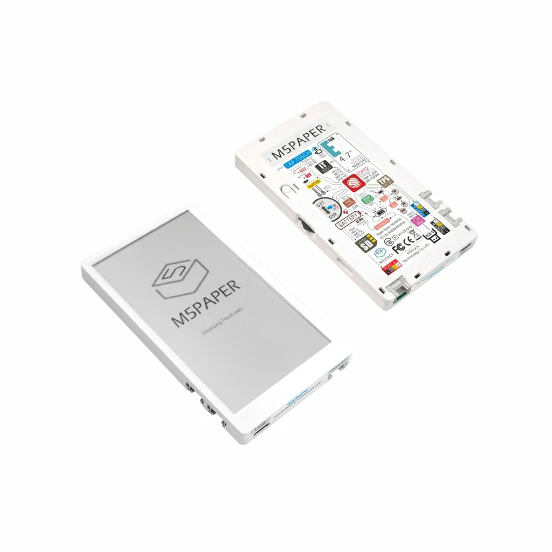 
ACCEL: <strong>No</strong> 
GYRO: <strong>No</strong> 
MAG: <strong>No</strong> 
<small>Includes Paper v1.1. Photograph shows v1.1.</small> 
</td>
<td width="25%" align="center" valign="top">
<strong><a href="https://docs.m5stack.com/zh_CN/core/PaperS3">PaperS3</a></strong> 
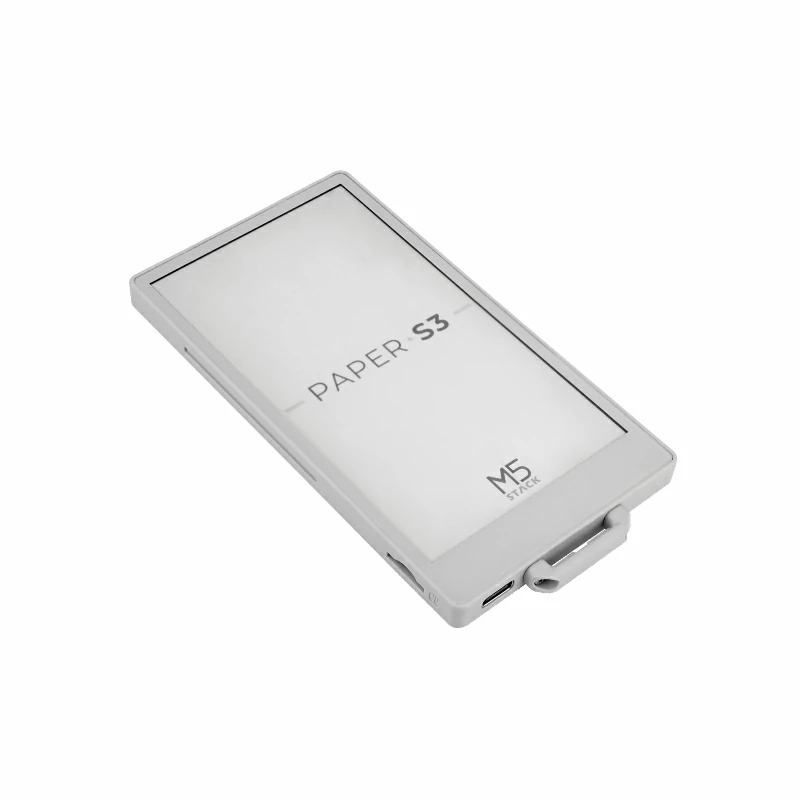 
ACCEL: <strong>Yes</strong> · BMI270 
GYRO: <strong>Yes</strong> · BMI270 
MAG: <strong>No</strong> 
</td>
<td width="25%" align="center" valign="top">
<strong><a href="https://docs.m5stack.com/zh_CN/core/PaperColor">PaperColor</a></strong> 
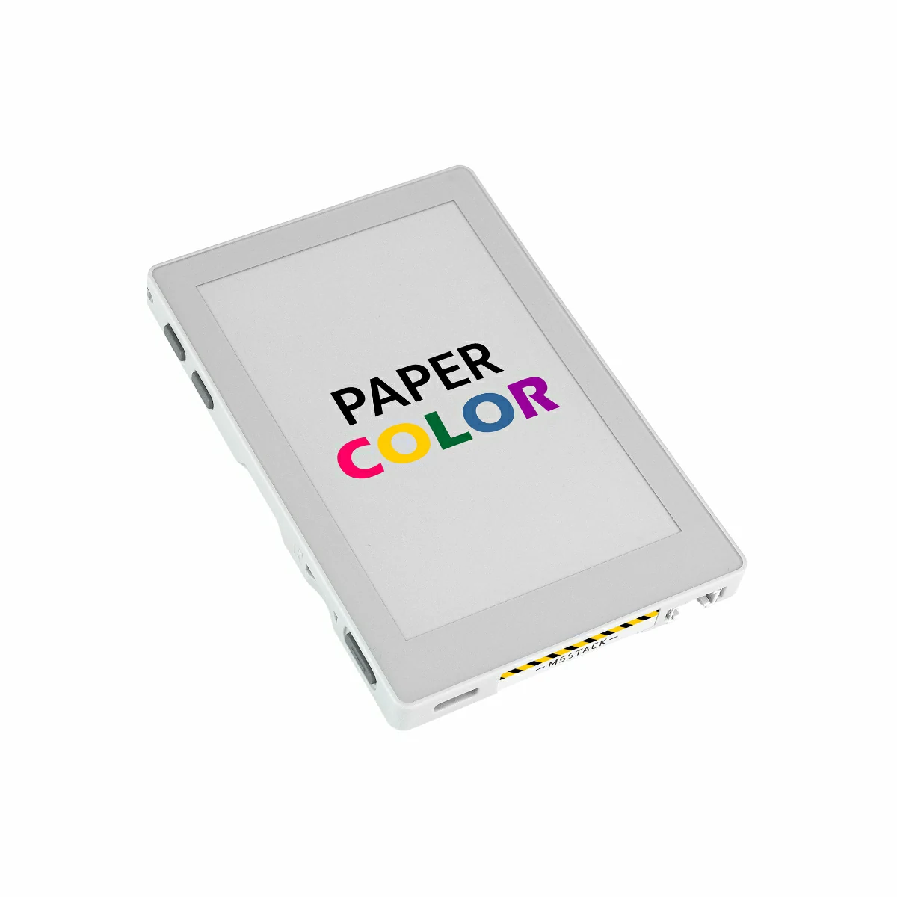 
ACCEL: <strong>No</strong> 
GYRO: <strong>No</strong> 
MAG: <strong>No</strong> 
</td>
</tr>
<tr>
<td width="25%" align="center" valign="top">
<strong>PaperDIY</strong> 

<em>Catalog image pending</em>

ACCEL: <strong>Pending</strong> 
GYRO: <strong>Pending</strong> 
MAG: <strong>Pending</strong> 
<small>No matching catalog card; public kit routes did not provide verifiable specifications.</small> 
</td>
<td width="25%" align="center" valign="top">
<strong><a href="https://docs.m5stack.com/zh_CN/core/PaperMono">PaperMono</a></strong> 
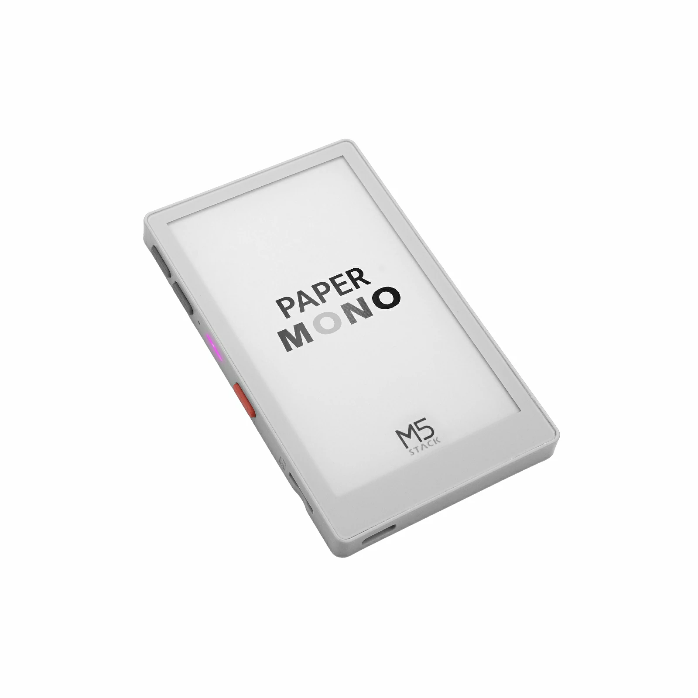 
ACCEL: <strong>Yes</strong> · BMI270 
GYRO: <strong>Yes</strong> · BMI270 
MAG: <strong>No</strong> 
<small>Includes PaperMono-Lite; both have BMI270.</small> 
</td>
<td width="25%"></td>
<td width="25%"></td>
</tr>
</table>

### Stick

<table>
<tr>
<td width="25%" align="center" valign="top">
<strong><a href="https://docs.m5stack.com/zh_CN/core/m5stickc">StickC</a></strong> 
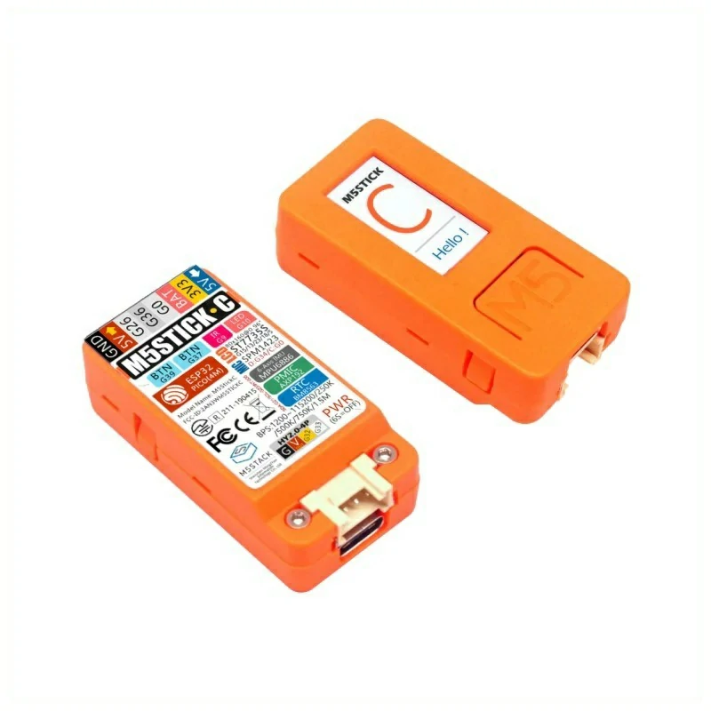 
ACCEL: <strong>Yes</strong> · MPU6886 
GYRO: <strong>Yes</strong> · MPU6886 
MAG: <strong>No</strong> 
<small>Earlier revisions use SH200Q.</small> 
</td>
<td width="25%" align="center" valign="top">
<strong><a href="https://docs.m5stack.com/zh_CN/core/m5stickc_plus">StickC-Plus</a></strong> 
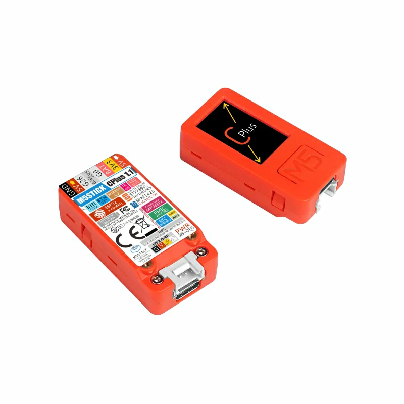 
ACCEL: <strong>Yes</strong> · MPU6886 
GYRO: <strong>Yes</strong> · MPU6886 
MAG: <strong>No</strong> 
</td>
<td width="25%" align="center" valign="top">
<strong><a href="https://docs.m5stack.com/zh_CN/core/M5StickC%20PLUS2">StickC-Plus2</a></strong> 
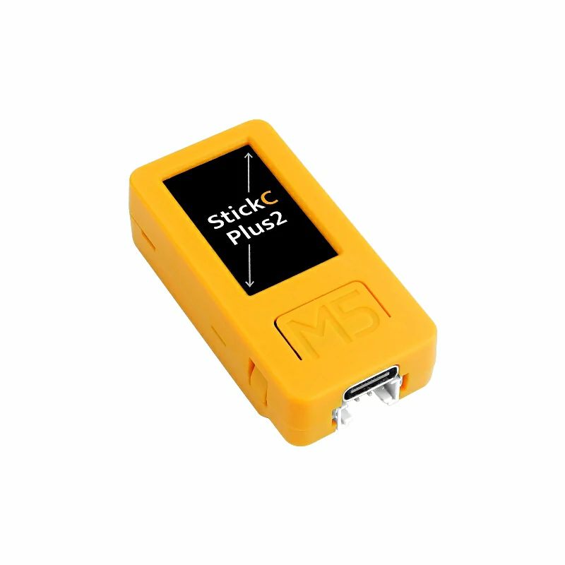 
ACCEL: <strong>Yes</strong> · MPU6886 
GYRO: <strong>Yes</strong> · MPU6886 
MAG: <strong>No</strong> 
</td>
<td width="25%" align="center" valign="top">
<strong><a href="https://docs.m5stack.com/zh_CN/core/StickS3">StickS3</a></strong> 
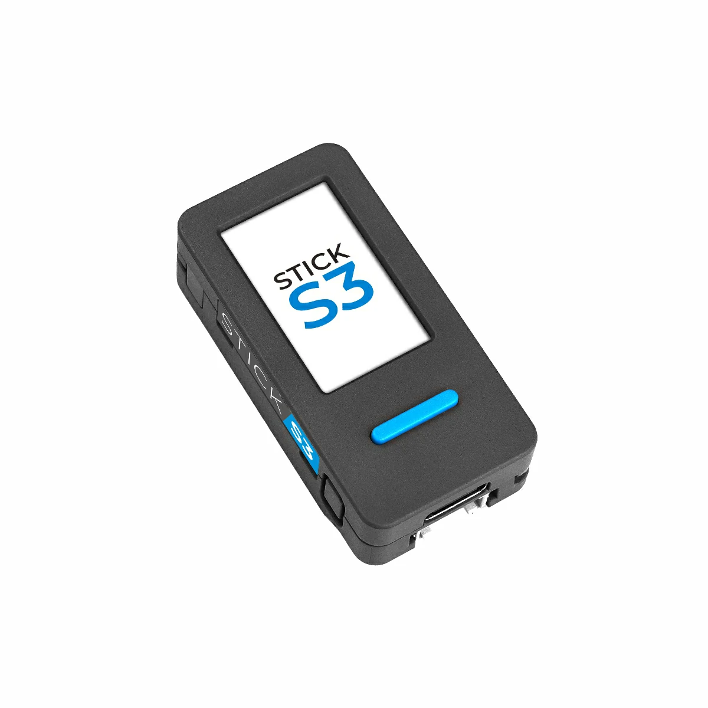 
ACCEL: <strong>Yes</strong> · BMI270 
GYRO: <strong>Yes</strong> · BMI270 
MAG: <strong>No</strong> 
</td>
</tr>
</table>

### Cardputer

<table>
<tr>
<td width="50%" align="center" valign="top">
<strong><a href="https://docs.m5stack.com/zh_CN/core/Cardputer%20V1.1">Cardputer</a></strong> 
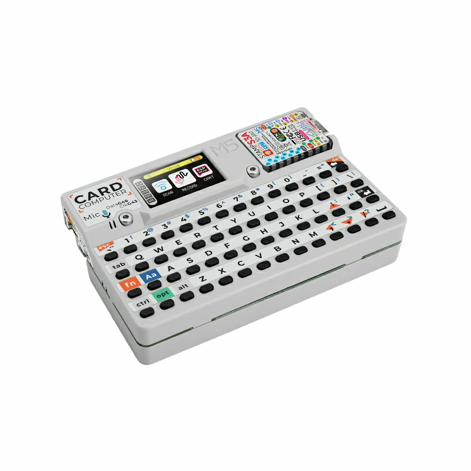 
ACCEL: <strong>No</strong> 
GYRO: <strong>No</strong> 
MAG: <strong>No</strong> 
<small>Includes v1.1; neither version has an IMU. Cardputer-Adv is a separate board.</small> 
</td>
<td width="50%" align="center" valign="top">
<strong><a href="https://docs.m5stack.com/zh_CN/core/Cardputer-Adv">Cardputer-Adv</a></strong> 
 
ACCEL: <strong>Yes</strong> · BMI270 
GYRO: <strong>Yes</strong> · BMI270 
MAG: <strong>No</strong> 
</td>
</tr>
</table>

### Others

<table>
<tr>
<td width="25%" align="center" valign="top">
<strong><a href="https://docs.m5stack.com/zh_CN/core/Tab5">Tab5</a></strong> 
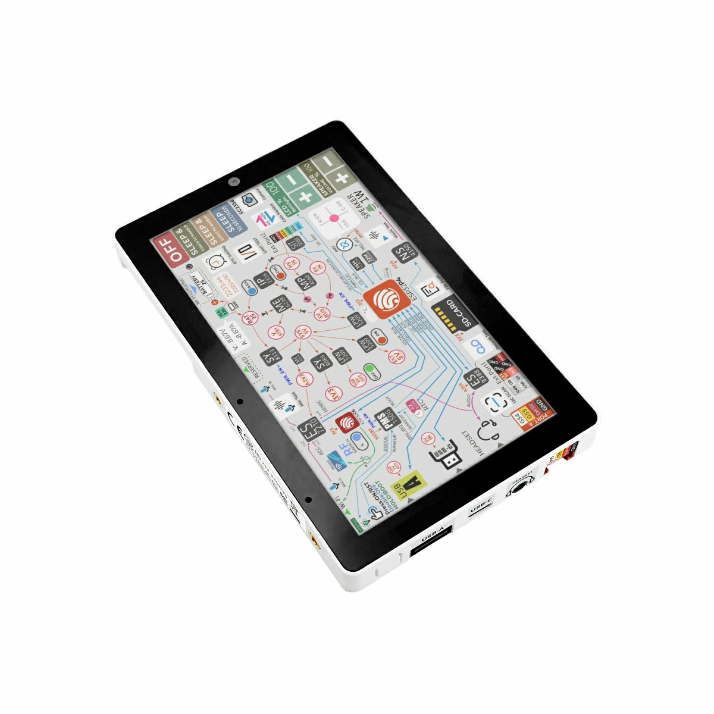 
ACCEL: <strong>Yes</strong> · BMI270 
GYRO: <strong>Yes</strong> · BMI270 
MAG: <strong>No</strong> 
</td>
<td width="25%" align="center" valign="top">
<strong>Tab5X</strong> 

<em>Catalog image pending</em>

ACCEL: <strong>Pending</strong> 
GYRO: <strong>Pending</strong> 
MAG: <strong>Pending</strong> 
<small>Official catalog image and sensor specification pending.</small> 
</td>
<td width="25%" align="center" valign="top">
<strong><a href="https://docs.m5stack.com/zh_CN/core/Air_Quality_v1.1">Air Quality</a></strong> 
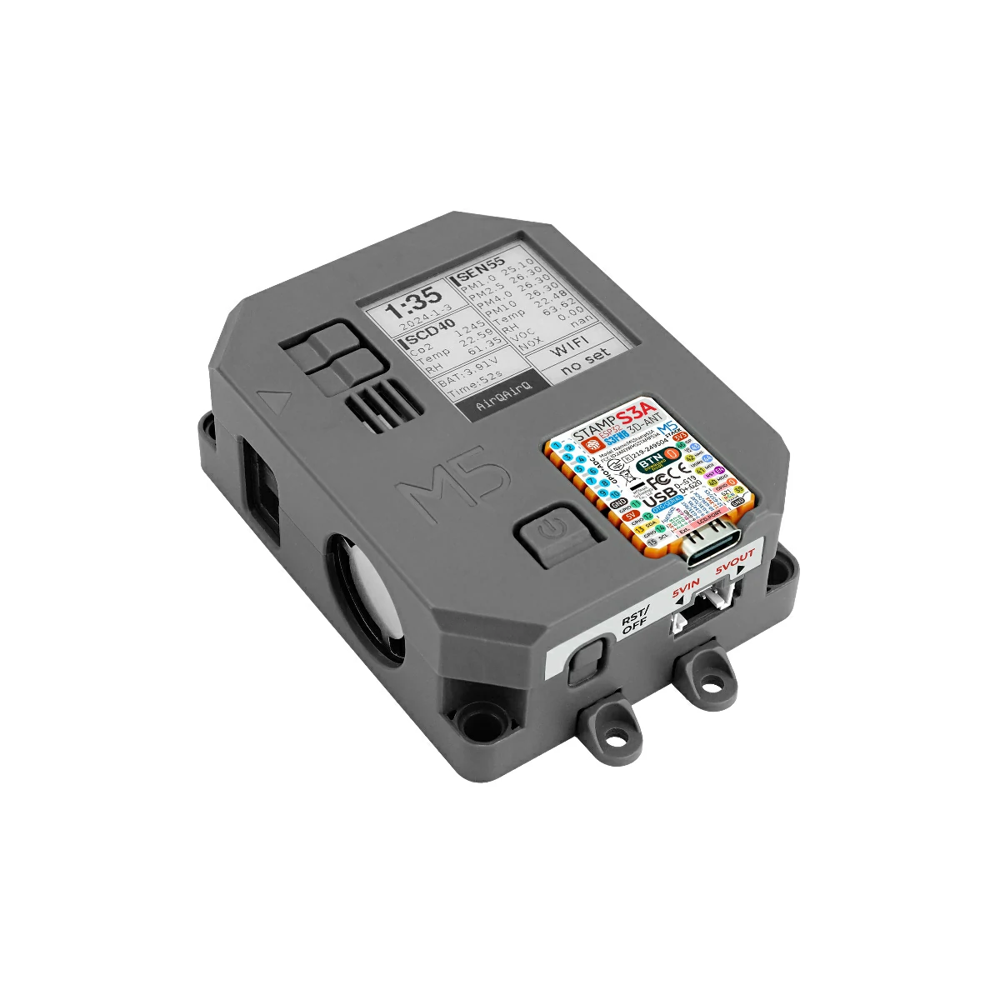 
ACCEL: <strong>No</strong> 
GYRO: <strong>No</strong> 
MAG: <strong>No</strong> 
<small>Includes v1.1. Photograph shows v1.1.</small> 
</td>
<td width="25%" align="center" valign="top">
<strong><a href="https://docs.m5stack.com/zh_CN/core/M5Dial%20V1.1">Dial</a></strong> 
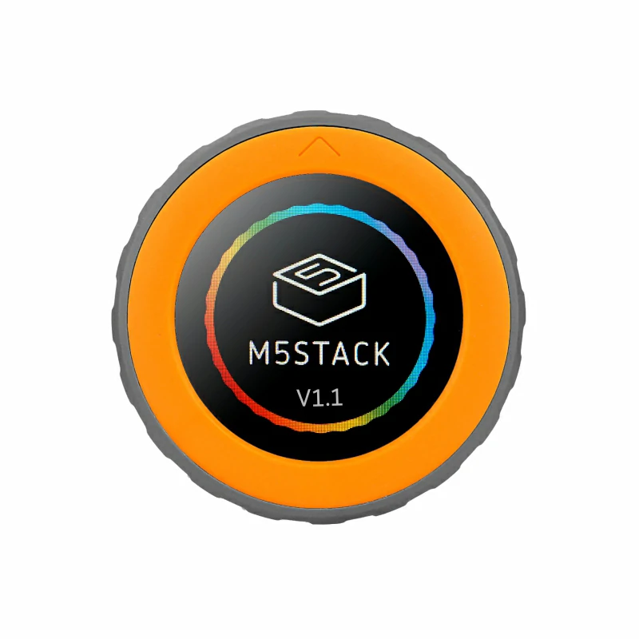 
ACCEL: <strong>No</strong> 
GYRO: <strong>No</strong> 
MAG: <strong>No</strong> 
<small>Includes v1.1. Photograph shows v1.1.</small> 
</td>
</tr>
<tr>
<td width="25%" align="center" valign="top">
<strong><a href="https://docs.m5stack.com/zh_CN/core/DinMeter_v1.1">DinMeter</a></strong> 
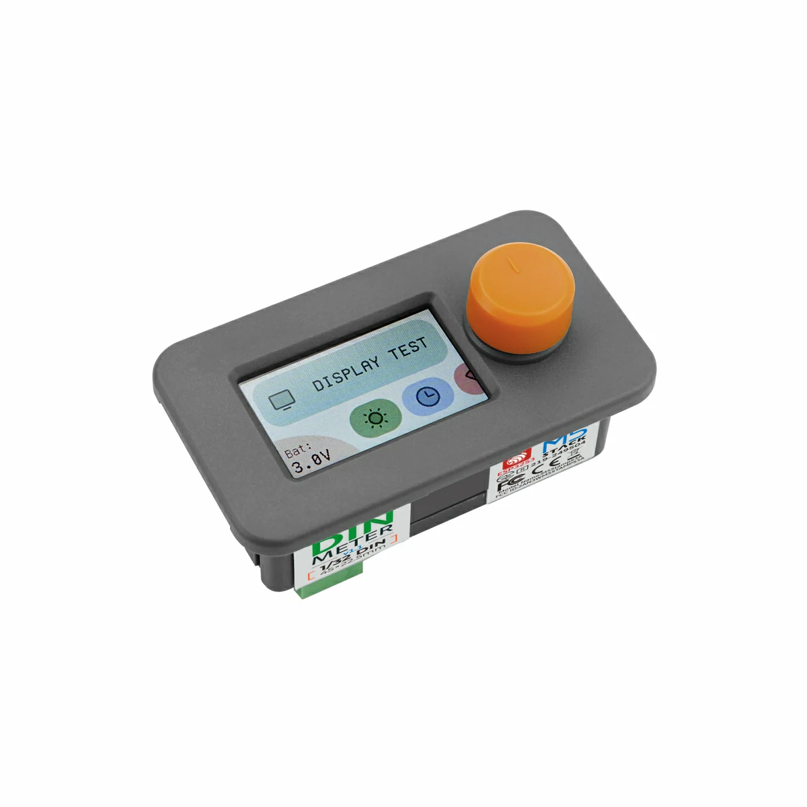 
ACCEL: <strong>No</strong> 
GYRO: <strong>No</strong> 
MAG: <strong>No</strong> 
<small>Includes v1.1. Photograph shows v1.1.</small> 
</td>
<td width="25%" align="center" valign="top">
<strong><a href="https://docs.m5stack.com/zh_CN/core/StamPLC">StamPLC</a></strong> 
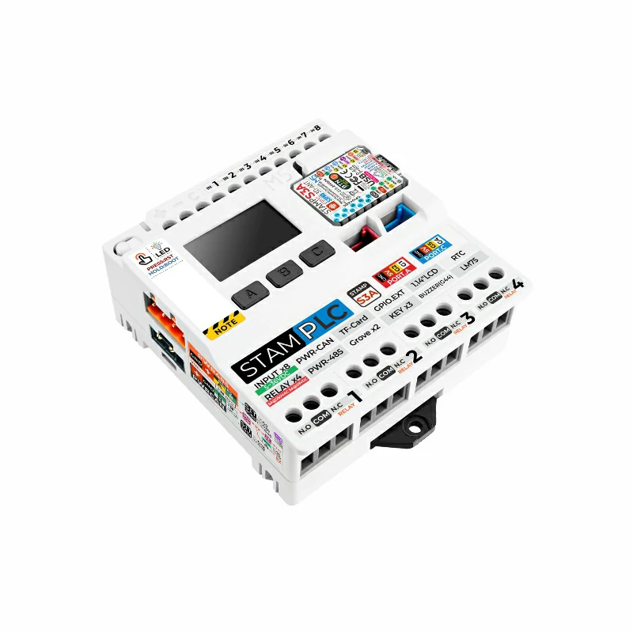 
ACCEL: <strong>No</strong> 
GYRO: <strong>No</strong> 
MAG: <strong>No</strong> 
</td>
<td width="25%" align="center" valign="top">
<strong><a href="https://docs.m5stack.com/zh_CN/core/station_bat">Station</a></strong> 
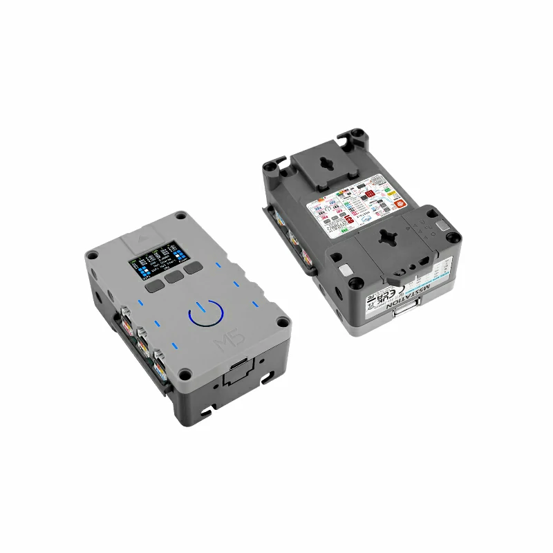 
ACCEL: <strong>Varies</strong> 
GYRO: <strong>Varies</strong> 
MAG: <strong>No</strong> 
<small>Station-Bat: MPU6886 ACCEL/GYRO. Station-485: no ACCEL/GYRO. Neither has MAG. Photograph shows Station-Bat.</small> 
</td>
<td width="25%" align="center" valign="top">
<strong><a href="https://docs.m5stack.com/zh_CN/core/StopWatch">StopWatch</a></strong> 
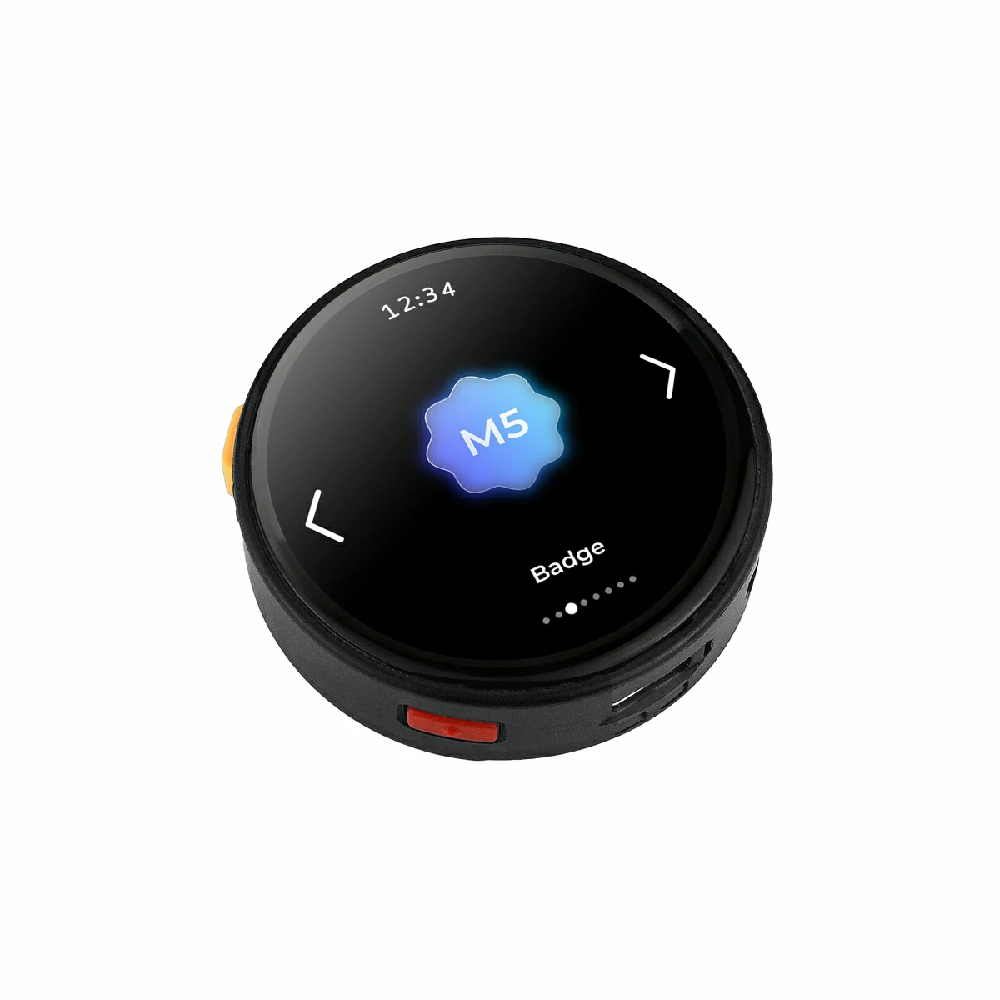 
ACCEL: <strong>Yes</strong> · BMI270 
GYRO: <strong>Yes</strong> · BMI270 
MAG: <strong>No</strong> 
</td>
</tr>
<tr>
<td width="25%" align="center" valign="top">
<strong><a href="https://docs.m5stack.com/zh_CN/unit/Unit_C6L">Unit C6L</a></strong> 
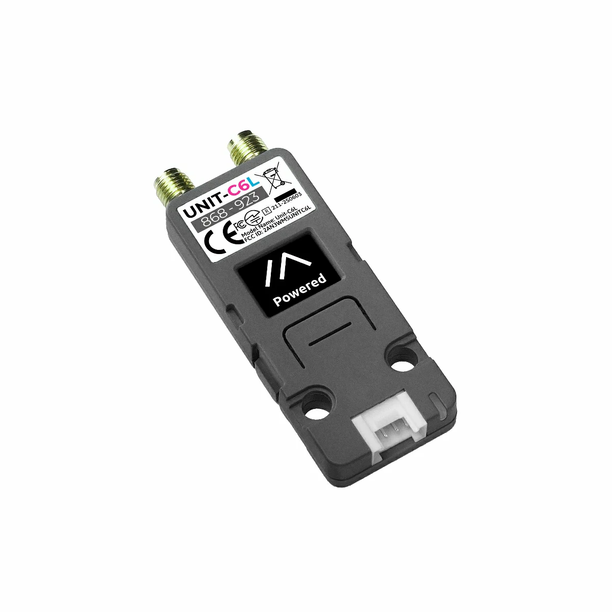 
ACCEL: <strong>No</strong> 
GYRO: <strong>No</strong> 
MAG: <strong>No</strong> 
</td>
<td width="25%" align="center" valign="top">
<strong><a href="https://docs.m5stack.com/zh_CN/chain/Chain_Captain">Chain Captain</a></strong> 

<em>Catalog image pending</em>

ACCEL: <strong>Yes</strong> · BMI270 
GYRO: <strong>Yes</strong> · BMI270 
MAG: <strong>Yes</strong> · BMM150 
<small>Preliminary official product description; catalog image pending.</small> 
</td>
<td width="25%" align="center" valign="top">
<strong><a href="https://docs.m5stack.com/zh_CN/core/Arduino_Nesso_N1">Arduino Nesso N1</a></strong> 
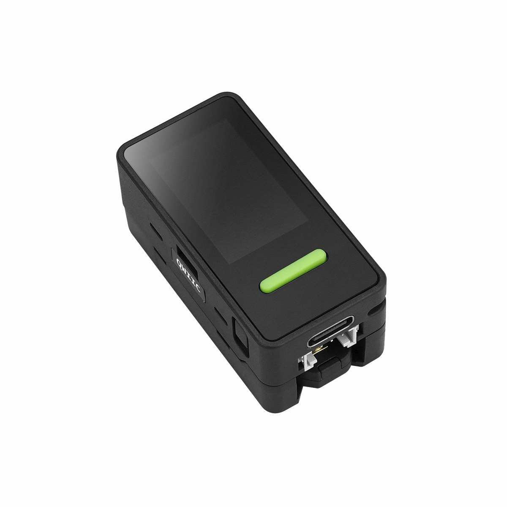 
ACCEL: <strong>Yes</strong> · BMI270 
GYRO: <strong>Yes</strong> · BMI270 
MAG: <strong>No</strong> 
</td>
<td width="25%" align="center" valign="top">
<strong><a href="https://docs.m5stack.com/zh_CN/core/VA%20Meter">VAMeter</a></strong> 
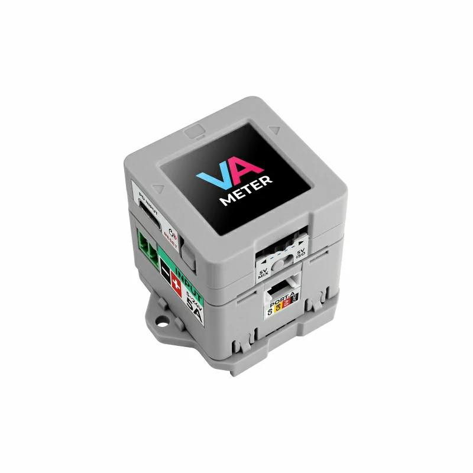 
ACCEL: <strong>No</strong> 
GYRO: <strong>No</strong> 
MAG: <strong>No</strong> 
</td>
</tr>
<tr>
<td width="25%" align="center" valign="top">
<strong>CoreP4X</strong> 

<em>Catalog image pending</em>

ACCEL: <strong>Pending</strong> 
GYRO: <strong>Pending</strong> 
MAG: <strong>Pending</strong> 
<small>Official catalog image and sensor specification pending.</small> 
</td>
<td width="25%"></td>
<td width="25%"></td>
<td width="25%"></td>
</tr>
</table>

## Evidence notes

- **Tough:** the official Core selector lists MPU6886, but the product page's
  specifications and pin map omit it. ACCEL/GYRO remain Pending.
- **Station-Bat:** features, pin map and selector identify MPU6886; its
  specifications spell the part MPU6686. Station-485's mention of MPU6886
  describes the Bat model, not an IMU fitted to Station-485.
- **Missing images:** ToughC5, PaperDIY, Tab5X, Chain Captain and CoreP4X remain
  in the board list without substituting another host's photograph.

[IMU API](../api/imu.md) · [CoreS3 sensors](cores3-imu.md) ·
[IMU axis test](../guides/imu-axis-test.md) · [Device index](README.md)
